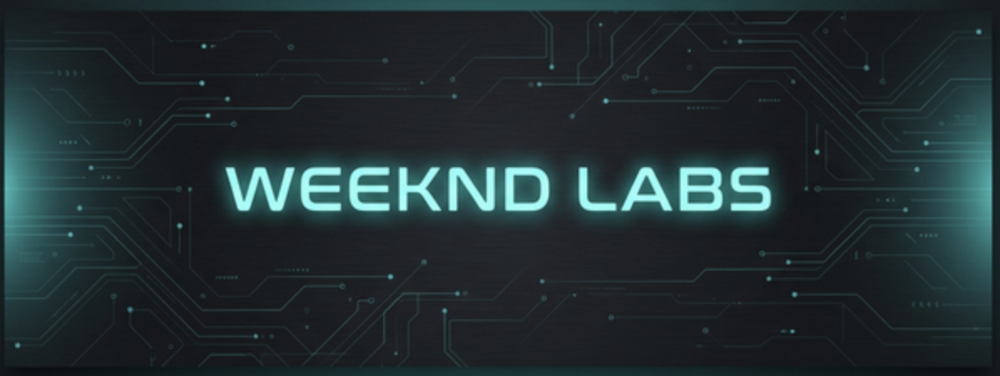

  
  
  ### **Infrastructure for the Agentic Era**
  
  
  
  

 

## ☄️ Our Philosophy

At **WeekndLabs**, we don't just build tools; we build the foundational layer for a future where AI and agents are the primary drivers of software. We believe the path to this future must be paved with transparency, builder empathy, and a commitment to openness.

### 🏛️ The Commitments
- **Raw, Unfiltered Open Source:** Everything we build is shipped open. No hidden enterprise features, no gated "open core" nuances.
- **Builder-First Empathy:** We prioritize CLI ergonomics, low latency, extreme predictability, and local-first workflows.
- **Radical Ownership:** Strictly MIT or Apache 2.0. If you build on our infra, you own it—period.

---

## 🏗️ Core Infrastructure

Our projects are designed to scale agentic systems without the friction of proprietary silos.

- **[OMNI](https://github.com/weekndlabs/omni):** The semantic distillation engine for the agentic age.
- **[ForgePod](https://github.com/weekndlabs/forgepod):** The lightweight, Podman-powered PaaS built for the Agentic Era. Ship containers with Heroku-like simplicity, managed by Infrastructure AI Agents.
- **[AI PR Describer](https://github.com/weekndlabs/ai-pr-describer):** Automating development context through AI.

---

## 🌏 SEA Origins, Global Standards

Proudly innovating from **Southeast Asia**. We are building a developer ecosystem that combines regional grit with world-class engineering standards.

  

    <a href="https://weekndlabs.com">Website</a> •
    <a href="https://twitter.com/weekndlabs">Twitter</a> •
    <a href="https://discord.gg/weekndlabs">Discord</a>
  

  
  &copy; 2026 Weeknd Labs. Built for the agents.

